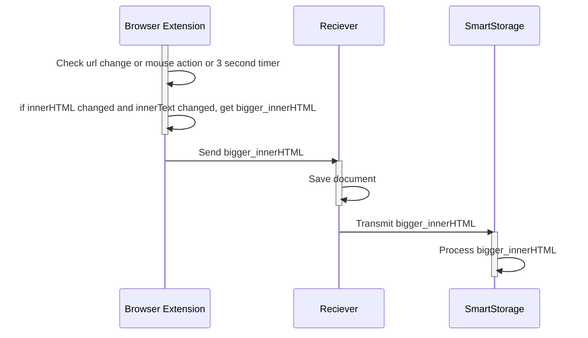

```mermaid
sequenceDiagram
    participant A as Browser Extension
    participant B as Reciever
    participant C as SmartStorage

    activate A
    A->>A: Check url change or mouse action or 3 second timer
    A->>A: if innerHTML changed and innerText changed, get bigger_innerHTML 
    deactivate A

    A->>B: Send bigger_innerHTML

    activate B
    B->>B: Save document 
    deactivate B

    B->>C: Transmit bigger_innerHTML

    activate C
    C->>C: Process bigger_innerHTML
    deactivate C

```

