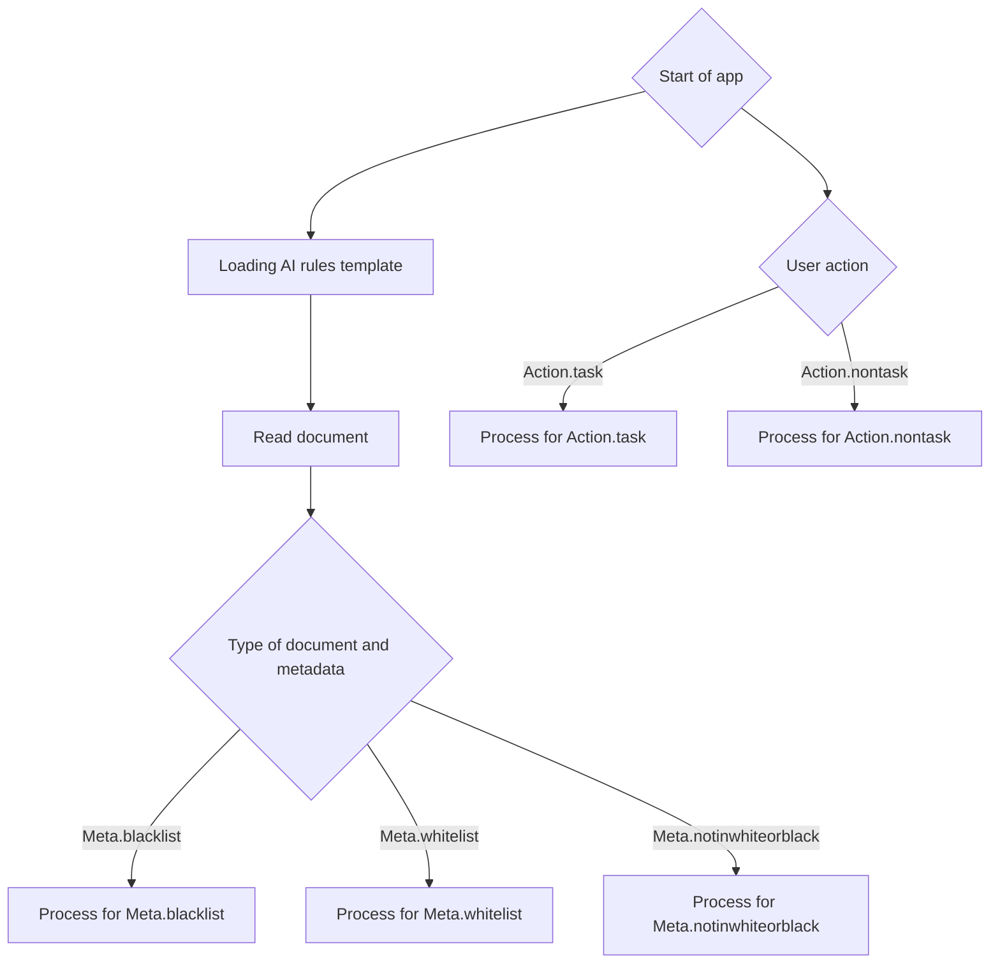

```mermaid
graph TD
    A{"Start of app"} --> B["Loading AI rules template"]
    B --> C["Read document"]
    C --> D{"Type of document and metadata"}
    D --> |Meta.blacklist| F[Process for Meta.blacklist]
    D --> |Meta.whitelist| G[Process for Meta.whitelist]
    D --> |Meta.notinwhiteorblack| H[Process for Meta.notinwhiteorblack]

    A --> B1{"User action"}
    B1 --> |Action.task| F1[Process for Action.task]
    B1 --> |Action.nontask| G1[Process for Action.nontask]

    
```